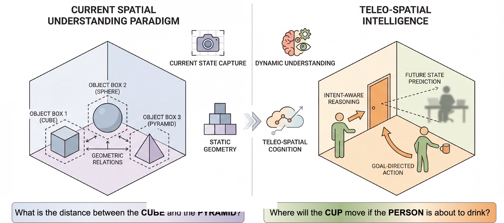
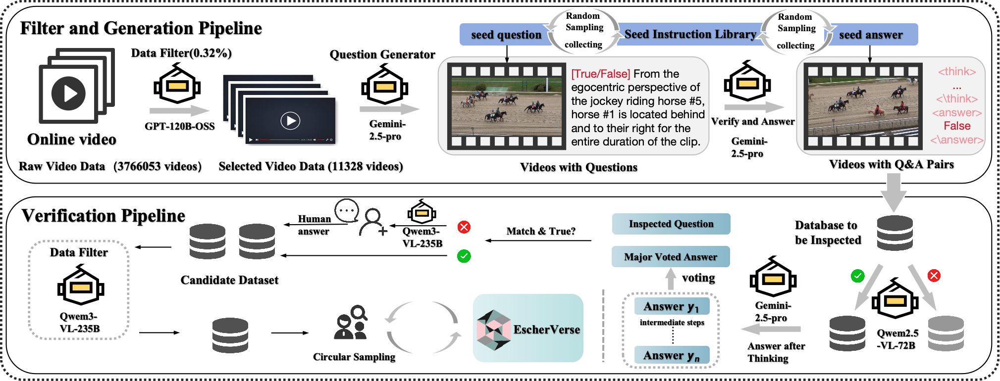
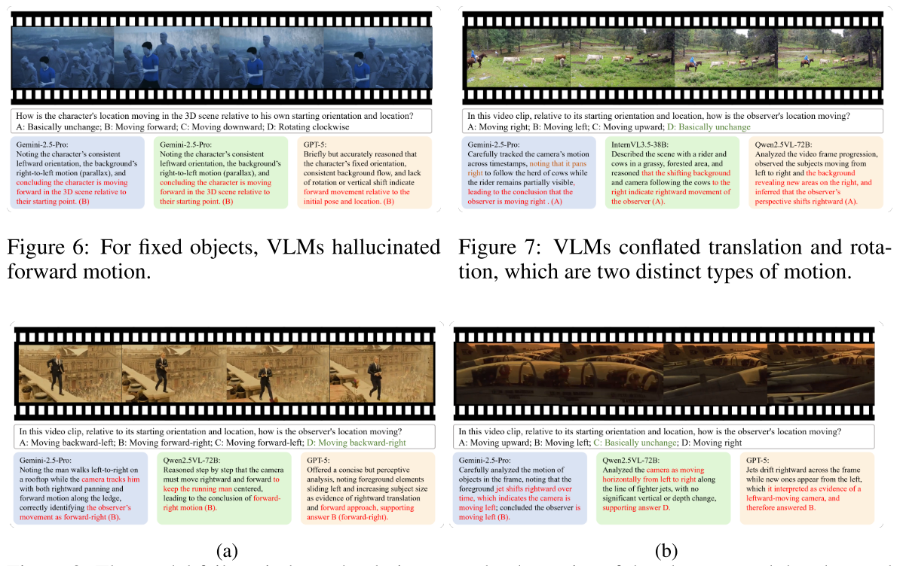
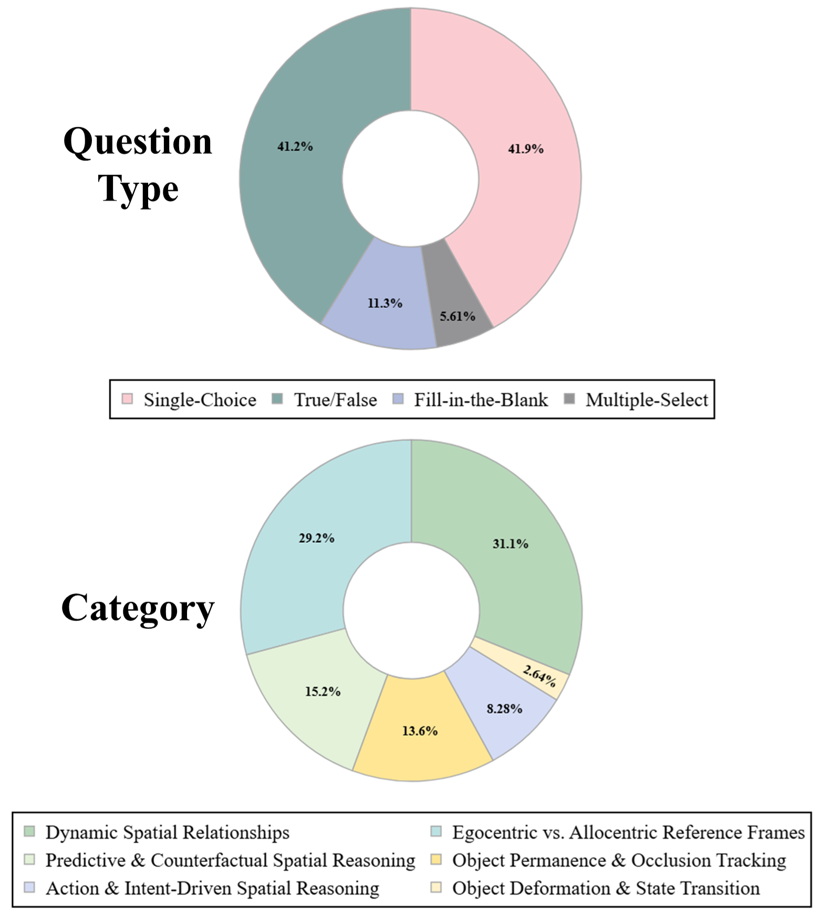

# EscherVerse

<p align="center">
  
</p>

<p align="center">
  <a href="https://huggingface.co/datasets/Gradygu3u/Escher-Data"></a>
  <a href="#"></a>
  <a href="#license"></a>
</p>

## 🌟 Overview

**EscherVerse** is a large-scale, open-world benchmark and dataset for evaluating **Advanced Spatial Intelligence (ASI)** in Vision-Language Models. It introduces a new paradigm that unifies:

- **Physical-Dynamic Reasoning**: Understanding the physical principles of object interactions
- **Intent-Driven Reasoning**: Inferring the human goals behind spatial changes

<p align="center">
  
</p>

## 📊 Key Features

| Feature | Description |
|---------|-------------|
| **Open-World** | Real-world videos, not simulated environments |
| **Dynamic** | Focus on temporal changes, not static scenes |
| **Human-Centric** | First benchmark for Intent-Driven Reasoning |
| **Comprehensive** | 8K benchmark + 35K training samples |

## 📁 Dataset

Download from [🤗 Hugging Face](https://huggingface.co/datasets/Gradygu3u/Escher-Data):

| File | Description | Size |
|------|-------------|------|
| `Escher-Bench.json` | Benchmark evaluation set | 8,000 QA pairs |
| `Escher-sft.jsonl` | SFT training data | 35,963 QA pairs |
| `Escher-GRPO-Subset.jsonl` | GRPO training subset | 3,588 samples |
| `video_list.json` | Video metadata | 11,328 videos |

### Spatial Reasoning Categories

1. **Object Permanence & Occlusion Tracking** - Understanding object continuity
2. **Dynamic Spatial Relationships** - Reasoning about changing relations
3. **Action & Intent-Driven Spatial Reasoning** - Inferring human goals
4. **Predictive & Counterfactual Reasoning** - Predicting outcomes
5. **Object Deformation & State Transition** - Physical state changes
6. **Egocentric vs. Allocentric Reference Frames** - Viewpoint reasoning

## 🚀 Quick Start

### Installation

```bash
git clone https://github.com/Grady10086/EscherVerse.git
cd EscherVerse
pip install -r requirements.txt
```

### Download Data

```bash
# Download benchmark data
huggingface-cli download Gradygu3u/Escher-Data --local-dir ./data

# Download videos (contact authors for access)
```

### Run Evaluation

```bash
# Local model (e.g., Qwen3-VL-8B)
python eval/evaluate.py \
    --model qwen3-vl-8b \
    --data_path ./data/Escher-Bench.json \
    --video_dir ./data/videos \
    --output_dir ./results

# API model (e.g., GPT-4o)
python eval/evaluate.py \
    --model gpt-4o \
    --api_key YOUR_API_KEY \
    --data_path ./data/Escher-Bench.json \
    --video_dir ./data/videos
```

### Supported Models

**Local Models:**
- `qwen3-vl-8b`, `qwen3-vl-4b`, `qwen3-vl-2b`
- `qwen2.5-vl-7b`, `qwen2.5-vl-3b`
- `llava-onevision-7b`
- `internvl3-8b`

**API Models:**
- `gpt-4o`, `gpt-4o-mini`
- `gemini-2.5-pro`, `gemini-2.5-flash`
- `claude-3.5-sonnet`

## 📈 Leaderboard

| Rank | Model | Overall | Human-Centric | Object-Centric |
|------|-------|---------|---------------|----------------|
| 1 | Gemini-2.5-Pro | 57.26% | 49.70% | 49.18% |
| 2 | Escher-8B-SFT | 49.85% | - | - |
| 3 | Qwen3-VL-32B-Thinking | 49.58% | 49.70% | 49.18% |
| 4 | Qwen3-VL-8B-Instruct | 45.06% | 45.74% | 42.86% |
| 5 | GPT-5 | 44.50% | - | - |

<details>
<summary>Full Results by Category</summary>

| Model | Object Permanence | Dynamic Spatial | Intent-Driven | Predictive | Deformation | Egocentric |
|-------|-------------------|-----------------|---------------|------------|-------------|------------|
| Gemini-2.5-Pro | 49.26% | 49.80% | 58.76% | 49.34% | 60.19% | 46.04% |
| Qwen3-VL-32B-Thinking | 49.26% | 49.80% | 58.76% | 49.34% | 60.19% | 46.04% |
| Escher-8B-SFT | 46.69% | 43.98% | 63.60% | 43.08% | 58.29% | 42.21% |

</details>

## 🔧 Training

Fine-tune your model on Escher-35k:

```python
from datasets import load_dataset

# Load training data
dataset = load_dataset("Gradygu3u/Escher-Data", data_files="Escher-sft.jsonl")

# Training format
# {
#   "messages": [
#     {"role": "user", "content": "<video>\n[Question]..."},
#     {"role": "assistant", "content": "<think></think>\n<answer>C</answer>"}
#   ],
#   "videos": ["video_filename.mp4"],
#   "metadata": {"category": "...", "scene_type": "...", "question_type": "..."}
# }
```

## 🔍 Case Study

<p align="center">
  
</p>

## 📊 Data Overview

<p align="center">
  
</p>

## 📝 Citation

```bibtex
@inproceedings{escherverse2026,
  title={EscherVerse: An Open World Benchmark and Dataset for Advanced Spatial Intelligence with Physical-Dynamic and Intent-Driven Understanding},
  author={Anonymous},
  booktitle={CVPR},
  year={2026}
}
```

## 📄 License

This project is licensed under [CC BY-NC 4.0](https://creativecommons.org/licenses/by-nc/4.0/).

## 🙏 Acknowledgments

We thank all contributors and the open-source community for their support.
