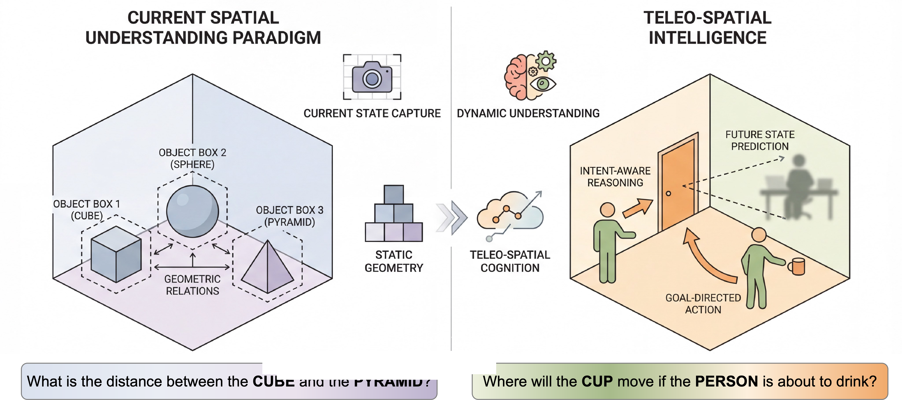
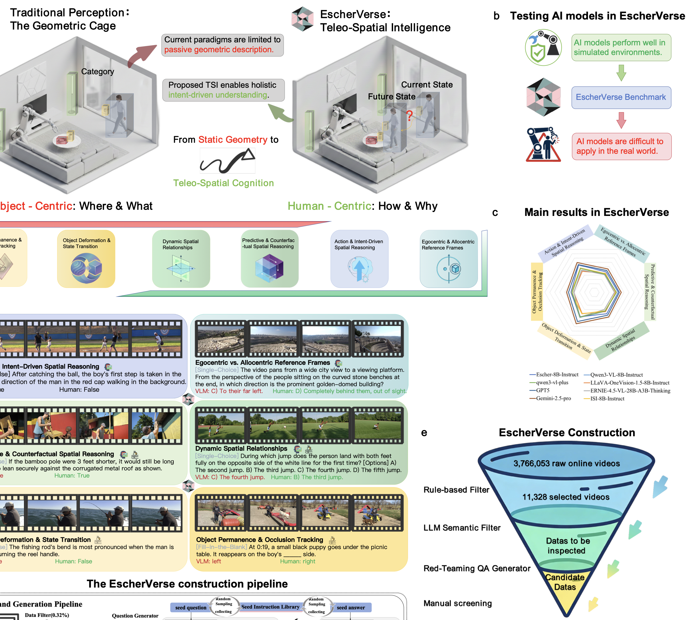

# EscherVerse

<p align="center">
  
</p>

<p align="center">
  
</p>

<p align="center">
  <a href="https://huggingface.co/datasets/Gradygu3u/EscherVerse-Data"></a>
  <a href="https://arxiv.org/abs/2601.01547"></a>
  <a href="#license"></a>
</p>

## Overview

**EscherVerse** is a large-scale open-world benchmark and training resource for **Teleo-Spatial Intelligence (TSI)** in vision-language models. TSI refers to the joint ability to reason about physical dynamics, reference frames, and goal-directed human action in real-world scenes.

This repository accompanies our paper, [*Vision-language models lag human performance on physical dynamics and intent reasoning*](https://arxiv.org/abs/2601.01547), and provides the released benchmark annotations, instruction-tuning annotations, metadata, and evaluation code.

## Highlights

- **11,328 real-world videos** curated from open-world human and object interactions
- **8,000-example benchmark** for evaluation
- **35,963-example instruction-tuning set** for model development
- **27 evaluated models** under a unified zero-shot protocol
- **Independent first-pass human baseline** from 11 annotators

## Main findings

| Setting | System | Overall accuracy |
|---------|--------|------------------|
| Best proprietary model | Gemini-2.5-Pro | **57.26%** |
| Best open-weight baseline | Qwen3-VL-32B-Thinking | **49.58%** |
| Best Escher model | Escher-8B-Instruct | **49.85%** |
| First-pass human mean | 11 annotators | **90.62%** |
| First-pass human range | 11 annotators | **84.81% - 95.14%** |

These results indicate a large and persistent gap between current vision-language models and human performance on teleo-spatial reasoning in open-world environments.

## Released resources

The repository and linked dataset currently provide:

- **Benchmark annotations** for EscherVerse evaluation
- **Instruction-tuning annotations** for model development
- **Metadata** for the released video set
- **Evaluation code** for running benchmark experiments

The following files are hosted on [Hugging Face](https://huggingface.co/datasets/Gradygu3u/EscherVerse-Data):

| File | Description |
|------|-------------|
| `Escher-Bench.json` | Benchmark evaluation set |
| `Escher-sft.jsonl` | Instruction-tuning data |
| `Escher-GRPO-Subset.jsonl` | Preference / GRPO subset |
| `video_list.json` | Video metadata |

## Data formats

The released files use different schemas for evaluation and training.

### Benchmark format

`Escher-Bench.json` stores evaluation examples as JSON objects with fields such as:

```json
{
  "index": 1,
  "P": "video_filename.mp4",
  "Q": "[Single-Choice] ...",
  "A": "B",
  "C": "Category 3: Action & Intent-Driven Spatial Reasoning",
  "scene_type": "Human-Centric",
  "question_type": "Single-Choice"
}
```

### Instruction-tuning format

`Escher-sft.jsonl` stores training examples in conversational format:

```json
{
  "messages": [
    {"role": "user", "content": "<video>\n[Question] ..."},
    {"role": "assistant", "content": "<think>...</think>\n<answer>C</answer>"}
  ],
  "videos": ["video_filename.mp4"],
  "metadata": {
    "category": "Action & Intent-Driven Spatial Reasoning",
    "scene_type": "Human-Centric",
    "question_type": "Single-Choice"
  }
}
```

## Data access

Download the released files from Hugging Face:

```bash
huggingface-cli download Gradygu3u/EscherVerse-Data \
  --repo-type dataset \
  --local-dir ./data
```

Or download specific files:

```bash
huggingface-cli download Gradygu3u/EscherVerse-Data Escher-Bench.json Escher-sft.jsonl video_list.json \
  --repo-type dataset \
  --local-dir ./data
```

Note that the benchmark and training files use different schemas, so direct file download is recommended.

The underlying raw clips are derived from third-party online platforms. For this reason, source video files are **not** redistributed as an unrestricted public download. Access to retained clips is controlled and subject to availability and source-platform terms.

## Quick start

### Installation

```bash
git clone https://github.com/Grady10086/EscherVerse.git
cd EscherVerse
pip install -r requirements.txt
```

### Run evaluation

```bash
# Local model
python eval/evaluate.py \
    --model qwen3-vl-8b \
    --data_path ./data/Escher-Bench.json \
    --video_dir ./data/videos \
    --output_dir ./results

# API model
python eval/evaluate.py \
    --model gpt-4o \
    --api_key YOUR_API_KEY \
    --data_path ./data/Escher-Bench.json \
    --video_dir ./data/videos \
    --output_dir ./results
```

Supported model interfaces currently include local transformer-based VLMs and API-based proprietary models such as GPT, Gemini, and Claude-family systems. See [eval/evaluate.py](eval/evaluate.py) for the maintained list.

## Evaluation protocol

The released evaluation code follows the protocol used in the paper:

- **Unified zero-shot prompting** across supported models
- **16 uniformly sampled video frames** per example by default
- **Deterministic decoding** for comparable runs
- **`<answer>...</answer>` answer extraction** for automated parsing
- **Question-type-specific scoring** for single-choice, multiple-select, true/false, and fill-in-the-blank items

## Repository structure

```text
assets/           Figures and overview assets
data/             Dataset access notes
eval/             Benchmark evaluation code
requirements.txt  Python dependencies
```

## Citation

If you use EscherVerse, please cite the associated paper:

- [Vision-language models lag human performance on physical dynamics and intent reasoning](https://arxiv.org/abs/2601.01547)

## License

This project is licensed under [CC BY-NC 4.0](https://creativecommons.org/licenses/by-nc/4.0/).

## Contact

For questions or issues, please open a GitHub issue.

For data access questions, contact:

- Tianjun Gu: TianjunGu_Grady@outlook.com
